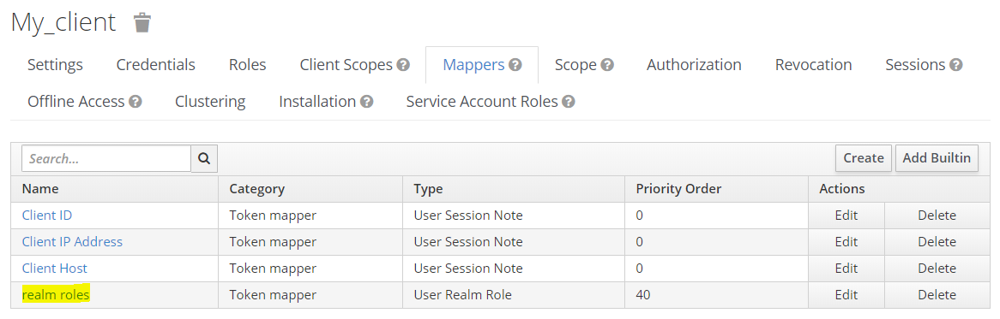

Spring security sample
======================

This sample provides guidelines to implement API security policies on a REST controller.
Spring security is used to implement an **OAuth 2.0 Resource server**.

This means that the REST controller is going to validate the **JWT Bearer token**
transmitted as a header alongside the API request.

Depending on the access control rules enforced for each method of the API controller,
the API client may have to obtain such token from an **OAuth 2.0 Authorization server**.

The sample REST controller of this repository illustrates a few examples of
access control rules that require:

- Either the **API Client** to have obtained some specific **scope**
- Or the authenticated **Resource owner** to have some specific **role**

Pre-requisites
--------------

In order to test this sample project, you need to setup an
**OAuth 2.0 Authorization Server**.

**Keycloak** is an easy to deploy / configure solution.

Get Keycloak: https://www.keycloak.org

You also have to understand the **OAuth 2.0 RFC**: https://tools.ietf.org/html/rfc6749
which defines the vocabulary used in this document and the **Authorization code grant**
flow that is illustrated in this sample.

Understanding Roles and Scopes
------------------------------

Let's take the example of an API meant to expose methods that allow an **API Client**
to perform requests on behalf of a **Resource owner**.

For each request, the **Resource server** must determine:

- Whether the API Client has the right to request the method, which can be
  *scope protected*. The **scope** describes the rights obtained by the client,
  they may have been subject to the resource owner's *consent*.
- Whether the Resource owner has the correct **role** to request the method.

A **scope** is dynamically granted by the Authorization server / Resource owner to
the API Client.

Inside of Keycloak for example, you can determine which scopes are associated to
a given API Client. For those scopes, you can decide whether they are:

- **Default scopes**: they will systematically be granted by the Authorization server.
- **Optional scopes**: they will be granted if requested by the client in the
  authorization request and may be subject to the consent of the Resource owner.

Whereas the **role** is inherent to the Resource Owner.  

Sample REST Controller
----------------------

This is a sample REST Controller before we setup API protection.

An unprotected variation of the component is available here: https://github.com/raoul-imolczek/accounts-service

It consists of 3 methods:

- A `ping` method that any anonymous client may call.
- An `accounts` method for which the client should have the consent
  from an authenticated account holder to make requests.
- An `accountDetails` method that requires an additional scope.
  Moreover, there should be a verification whether the requested
  account's details is belonging to the authenticated user.

.. code-block:: java

	@RestController
	@RequestMapping("/sample/api/v1")
	public class SampleController {
	
		private static Logger logger = LoggerFactory.getLogger(SampleController.class);
	
		private AccountsService accountsService;
		
		public SampleController(AccountsService accountsService) {
			this.accountsService = accountsService;
		}
		
		/**
		 * This method has no authorization requirement
		 * An anonymous user may call this method
		 * @return pong
		 */
		@GetMapping("/ping")
		public String ping() {
			return "pong";
		}
		
		/**
		 * List accounts
		 * @return List of accounts
		 */
		@GetMapping("/accounts")
		public List<AccountResource> accounts(String subject) {
			List<AccountResource> accounts = accountsService.list(subject);
			return accounts;
		}
	
		/**
		 * Account details
		 * @param accountNumber The account number
		 * @return List of accounts
		 */
		@GetMapping("/accounts/{accountNumber}")
		public AccountResource accountDetails(@PathVariable String accountNumber) {
			return accountsService.details(accountNumber);
		}
		
	}

Keycloak configuration
----------------------

To start Keycloak, run `bin/standalone.bat`, Keycloak runs by default on port 8080.

Upon first connection, create the administrator account and login to the
administration console. 

Roles definition
++++++++++++++++

We're going to create a `customer` role.

That role is going to be necessary to make requests to the `accounts`
and `accountDetails` methods.

The customer role does not need to bear any particular attribute.

Just click *Add role* and name the role `customer`.

Creation of users
+++++++++++++++++

We're going to create two **users**:

- John Doe, who has the `customer` role
- Jane Doe, who *doesn't* have the `customer` role

.. image:: docs/img/users-menu.png

Click *Add user* to create a user and fill in the fields.

You also have to go under the *Credentials* tab to create a password for the user.
Do not forget to uncheck *Temporary* for the test, otherwise the user will be
asked to change his password upon first connection.

And finally, let's add the `customer` role to John Doe under the *Role Mappings*
tab:

Definition of client scopes
+++++++++++++++++++++++++++

We're going to define two **client scopes**:

- `accounts:list`: a scope granted to an **API client** allowing it to request
  the `accounts` method.
- `accounts:details`: a scope granted to an **API client** allowing it to request
  the `accountDetails` method. 

Click *Create* to create the Client scope and fill in the form:

.. image:: docs/img/scope.png

You can add text that will be displayed to the user if explicit consent should
be asked to him upon delivering the Authorization code.

Creation of the client
++++++++++++++++++++++

We're going to create `my_client`:

Make sure to check the *Confidential* mode and to activate *Authorization enabled*.

Besides, enabling *Consent required* will have the consequence of displaying a list
of requested consents to the user before an **Authorization code** is delivered
to the API Client.

An important feature of OAuth 2.0 is to rely on the redirection to a URL owned by
the API Client to deliver the Authorization code. So make sure that the URL
configured here matches the URL of the Spring boot microservice:

The confidential client must obtain credentials so as to exhcange the authorization
code for an access token. You can read it here:

Go to the *Client Scopes* tab in order to add the optional scopes to the client.
It means that the client must request those scopes in the Authorization request to
get them from Keycloak in the JWT Access token.

Finally you can implement a custom mapper to add a `roles` claim to the JWT
Access token.  

Use the built-in *groups* mapper:

.. image:: docs/img/mappers-builtin.png

And specify its name and in which tokens you want to display the claim:

.. image:: docs/img/client-roles-mapper.png

Implementing Spring Security Resource server
--------------------------------------------

Spring security enforces access control rules on the `@RestController`'s methods.

It relies on what Spring Security calls **Authorities**.

In our example, we manage two kind of Authorities: scopes and roles.

Required dependencies
+++++++++++++++++++++

In order to add API Protection to a Spring boot REST controller, you need to
have the following dependencies:

.. code-block:: xml

    <dependency>
        <groupId>org.springframework.boot</groupId>
        <artifactId>spring-boot-starter-security</artifactId>
    </dependency>

    <dependency>
        <groupId>org.springframework.boot</groupId>
        <artifactId>spring-boot-starter-oauth2-resource-server</artifactId>
    </dependency>

Configuring the Spring Security Resource Server
+++++++++++++++++++++++++++++++++++++++++++++++

Spring security has built-in support for **OAuth 2.0 Resource server** policies.

All you need to do is to provide a class that extends `WebSecurityConfigurerAdapter`
with the `@EnableWebSecurity` annotation.

Besides, adding the `@EnableGlobalMethodSecurity(prePostEnabled = true)` makes
it possible to define the access control rules (checking *scopes* and *roles*)
at the `@RestController` level (instead of having one big `WebSecurityConfigurerAdapter`
implementing lots of `antMatchers`).

.. code-block:: java

	@EnableWebSecurity
	@EnableGlobalMethodSecurity(prePostEnabled = true)
	public class OAuth2ResourceServerSecurityConfiguration extends WebSecurityConfigurerAdapter {
	
		@Value("${security.oauth2.resourceserver.jwk.jwk-set-uri}") String jwkSetUri;
	
		@Override
		protected void configure(HttpSecurity http) throws Exception {
			// Enabling OAuth 2.0 Resource server security with JWT Token validation
			http.oauth2ResourceServer().jwt().jwtAuthenticationConverter(jwtAuthenticationConverter());
	
		}
		
		/**
		 * The way scopes and roles are defined in JWT tokens is not 100% standard
		 * Thus, you'll often have to specify your own conversion rules
		 * What we mean here with conversion, is how we map claims in JWT tokens
		 * as "Authorities" bound to the security context
		 * The mapped Authorities can be used in the @PreAuthorize annotations
		 * inside of the REST Controller
		 * @return the JwtAuthenticationConverter
		 */
	    private JwtAuthenticationConverter jwtAuthenticationConverter() {
	        JwtAuthenticationConverter jwtAuthenticationConverter = new JwtAuthenticationConverter();
	        jwtAuthenticationConverter.setJwtGrantedAuthoritiesConverter(new MyIDPAuthoritiesConverter());
	        return jwtAuthenticationConverter;
	    }	
	
	    /**
	     * Provision of a JwtDecoder bean that uses the IDP configuration from properties to
	     * decode the JWT access tokens provided alongside requests
	     * @return A JWTDecoder
	     */
		@Bean
		JwtDecoder jwtDecoder() {
			return NimbusJwtDecoder.withJwkSetUri(this.jwkSetUri).build();
		}
		
	}
	
`http.oauth2ResourceServer().jwt().jwtAuthenticationConverter(jwtAuthenticationConverter());` activates
the built-in Resource server policy.

It also relies on the `JwtDecoder` provided as a @Bean (responsible for the validation of the JWT tokens
against the **Authorization server**) and a `JwtAuthenticationConverter` which is a custom class
that implements the custom `Authority` mapping rules of the **claims** contained inside of the JWT
Token (roles and scopes claims).

The JWT token validation certificates are made available through configuration in the
`application.yaml` file located in `src/main/resources`:

.. code-block:: yaml

	security:
	  oauth2:
	    client:
	      accessTokenUri: http://127.0.0.1:8080/auth/realms/master/protocol/openid-connect/token
	      userAuthorizationUri: http://127.0.0.1:8080/auth/realms/master/protocol/openid-connect/auth
	    resourceserver:
	      jwk:
	        jwk-set-uri: http://127.0.0.1:8080/auth/realms/master/protocol/openid-connect/certs
	        
.. note:: Note
	The auth and token URLs are also provided here for documentation generation purposes
	(see *Swagger generation*).

Custom claims mapper
++++++++++++++++++++

Create a class implementing `Converter<Jwt, Collection<GrantedAuthority>>`.

This class wil extract Authorities from the JWT Token.

In our example, we want to extract the **scopes** and **roles** from the
JWT token delivered by Keycloak.

.. code-block:: java

	public class MyIDPAuthoritiesConverter implements Converter<Jwt, Collection<GrantedAuthority>> {
	
	    @Override
	    @SuppressWarnings("unchecked")
	    public Collection<GrantedAuthority> convert(final Jwt jwt) {
	        
	    	List<GrantedAuthority> rolesCollection =
	    			((List<String>) jwt.getClaim("roles")).stream()
	                .map(roleName -> "ROLE_" + roleName)
	                .map(SimpleGrantedAuthority::new)
	                .collect(Collectors.toList());
	
	        List<GrantedAuthority> scopesCollection =
	        		new ArrayList<String>(
	        				Arrays.asList(
	        						((String) jwt.getClaim("scope")).split(" ")
	        						)
	        				).stream()
	                .map(scopeName -> "SCOPE_" + scopeName)
	                .map(SimpleGrantedAuthority::new)
	                .collect(Collectors.toList());
	        
	        List<GrantedAuthority> grantedAuthorities = rolesCollection;
	        grantedAuthorities.addAll(scopesCollection);
	        
	        return grantedAuthorities;
	    }
	    
	}

This is an example of a JWT Token delivered by Keycloak that you can make
human readable using https://jwt.io:

.. code-block:: json

	{
	  "jti": "060a1258-8bfa-43fb-9694-d7abfe94c283",
	  "exp": 1584633273,
	  "nbf": 0,
	  "iat": 1584633213,
	  "iss": "http://localhost:8080/auth/realms/master",
	  "aud": "account",
	  "sub": "49976f9c-6e7e-44c0-bc01-e883937874c1",
	  "typ": "Bearer",
	  "azp": "my_client",
	  "auth_time": 1584632898,
	  "session_state": "89960b91-90b7-4d41-badf-83194407d8b4",
	  "acr": "0",
	  "allowed-origins": [
	    "http://localhost:9090"
	  ],
	  "realm_access": {
	    "roles": [
	      "offline_access",
	      "uma_authorization",
	      "customer"
	    ]
	  },
	  "resource_access": {
	    "account": {
	      "roles": [
	        "manage-account",
	        "manage-account-links",
	        "view-profile"
	      ]
	    }
	  },
	  "scope": "accounts:list profile email",
	  "email_verified": true,
	  "roles": [
	    "offline_access",
	    "uma_authorization",
	    "customer"
	  ],
	  "name": "John Doe",
	  "preferred_username": "john.doe",
	  "given_name": "John",
	  "family_name": "Doe",
	  "email": "john.doe@localhost"
	}

The Converter we have developed will eventually identify the following authorities
inside of JWT tokens:

- `ROLE_customer`
- `SCOPE_accounts:list`
- `SCOPE_accounts:details`

Protecting the REST Controller
++++++++++++++++++++++++++++++

We can now annotate the REST Controller to implement access control policies based
on those Authorities.

Let's first create a new `whoami` method that displays the information gathered
from the JWT Token:

.. code-block:: java

	@PreAuthorize("isAuthenticated()")
	@GetMapping("/whoami")
	public Whoami index(@AuthenticationPrincipal Jwt jwt, @CurrentSecurityContext SecurityContext context) {
		Iterator<? extends GrantedAuthority> authorities = context.getAuthentication().getAuthorities().iterator();
		
		Whoami response = new Whoami();
		response.setFirstName(jwt.getClaimAsString("given_name"));
		response.setLastName(jwt.getClaimAsString("family_name"));

		List<String> roles = new ArrayList<>();
		while(authorities.hasNext()) {
			roles.add(authorities.next().getAuthority());
		}
		response.setRoles(roles);

		return response;
	}

`isAuthenticated()` is a built-in method from the Spring Security framework that allows
you to check whether the request is authenticated. Otherwise, the method will throw an
**HTTP 401** response.

The annotated `@AuthenticationPrincipal Jwt jwt` and
`@CurrentSecurityContext SecurityContext context` parameters are passed by the Spring
Security framework (we will make them invisible in the *Swagger generation* configuration).

Now, let's protect the `accounts` method:

.. code-block:: java

	@PreAuthorize("hasAuthority('SCOPE_accounts:list') and hasAuthority('ROLE_customer')")
	@GetMapping("/accounts")
	public List<AccountResource> accounts(@AuthenticationPrincipal Jwt jwt) {
		List<AccountResource> accounts = accountsService.list(jwt.getClaimAsString("sub"));
		return accounts;
	}

Now, an unauthenticated request will get an **HTTP 401** response, whereas a request
whose token lacks either the `accounts:list` scope or the `customer` role will get
an **HTTP 403** response.

The `accountDetails` method requires some additional work:

.. code-block:: java

	@PreAuthorize("hasAuthority('SCOPE_accounts:details') and hasAuthority('ROLE_customer')")
	@GetMapping("/accounts/{accountNumber}")
	public AccountResource accountDetails(@AuthenticationPrincipal Jwt jwt, @PathVariable String accountNumber) throws WrongAccountHolderException {
		return accountsService.details(accountNumber, jwt.getClaimAsString("sub"));
	}

Whereas the `sub` (subject, ie. the ID of the authenticated user) is gathered from the JWT
Token, the `accountNumber` is obtained from the request path.

We have to make sure that the subject is the holder of that account or otherwise throw
a `WrongAccountHolderException`.

This task is not performed by Spring Security, this is a business rule. So I have delegated
this control to the AccountsService.

I've mocked this by checking the AccountNumber. If it ends with 9, then I consider that
the account does not belong to the authenticated subject in the Mock service:

.. code-block:: java

	@Override
	public AccountResource details(String accountNumber, String accountHolderId) throws WrongAccountHolderException {

		if(accountNumber.endsWith("9")) throw new WrongAccountHolderException();
		
		AccountResource account = new AccountResource();
		account.setAccountNumber(accountNumber);
		
		return account;
	} 

When defining an `Exception` that can be thrown by a REST Controller, make it
a `RuntimeException`and provide a `@ResponseStatus` annotation so as to help
Spring determine which HTTP status code to return.

Here, I want the `WrongAccountHolderException` to return an **HTTP 403** code.

.. code-block:: java

	@ResponseStatus(value = HttpStatus.FORBIDDEN)
	public class WrongAccountHolderException extends RuntimeException {
	
	} 

Swagger generation
++++++++++++++++++

Finally, you now want to update the Swagger generation configuration:

.. code-block:: java

	@Configuration
	@EnableSwagger2
	public class SwaggerConfig {
	    
		@Value("${security.oauth2.client.userAuthorizationUri}") String authUrl;
		@Value("${security.oauth2.client.accessTokenUri}") String tokenUrl;
		
		@Bean
	    public Docket api() { 
			List<AuthorizationScope> scopes = new ArrayList<>();
			scopes.add(new AuthorizationScope("accounts:list", "Right to list accounts"));
			scopes.add(new AuthorizationScope("accounts:details", "Right to consult accounts details"));
			
			List<GrantType> grantTypes = new ArrayList<>();
			
			String clientIdName = null;
			String clientSecretName = null;
			TokenRequestEndpoint tokenRequestEndpoint = new TokenRequestEndpoint(authUrl, clientIdName, clientSecretName);
			
			TokenEndpoint tokenEndpoint = new TokenEndpoint(tokenUrl, "jwt-token");
			grantTypes.add(new AuthorizationCodeGrant(tokenRequestEndpoint, tokenEndpoint));
	
			List<SecurityScheme> schemeList = new ArrayList<>();
			schemeList.add(new OAuth("bank_auth", scopes, grantTypes));
	
	        return new Docket(DocumentationType.SWAGGER_2)  
	        		.ignoredParameterTypes(AuthenticationPrincipal.class)
	        		.ignoredParameterTypes(CurrentSecurityContext.class)
	        		.select()               
	                .apis(RequestHandlerSelectors.withClassAnnotation(RestController.class))
	        		.paths(PathSelectors.any())
	        		.build()
	    			.securitySchemes(schemeList);                                           
	    }
	}

Add two `ignoredParameterTypes` to the Docket so as to hide the Spring Security Framework's
`@AuthenticationPrincipal` and `@CurrentSecurityContext` annotated variables from the
`@RestController`'s methods.

Add the `securitySchemes` that define the scopes and the OAuth endpoints of the **Authorization
server**.

The generated swagger file can be accessed at the following URL:
http://localhost:9090/v2/api-docs

Testing with Postman
--------------------

In order to request the API's endpoint in Postman, you'll have to request Access tokens:

Click the *Get new access token* button and fill in the **Authorization request**:

Be careful about which scopes you request.

If the Authorization Request is correct, you should see this screen the first time
followed by the consent screen:

As long as the user has a logged in session on Keycloak, you won't have to sign
in again to get a token. You can see the active user sessions from the Keycloak
administration console and force them to sign out if you wish so:

As soon as a user has given a client consents, he does not need to give them again.
If you wish to reset the consents, you can do so inside of the Keycloak administration
console:

 
Once the access token has been obtained, do not forget to select it in the menu:

 
And fire a request to the API:

Look at the HTTP Status code. If **HTTP 200**, you're good. Otherwise read the response
headers of payload to get a clue about why the request has been rejected.

You may get **HTTP 401** if the token has expired for example.

Or maybe you get **HTTP 403** because you have an insufficient scope.

Try signing in with **Jane Doe** who does not have the **customer** role or request
tokens without the necessary scopes to validate that Spring Security does the
protection job correctly.

Beyond Roles and Scopes
-----------------------

Scopes and Roles are just two kind of authorities you want to check when implementing
access control.

You may also take into account information from RFC 8693 Token Exchange:
https://datatracker.ietf.org/doc/rfc8693/ in order to validate that the request has
been made through the correct gateway (adding for example a new `GATEWAY_whatever`
Authority in the claims mapper).
